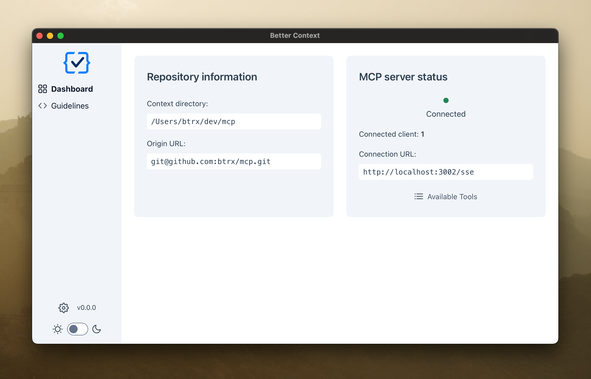

# Better Context

<div align="center">
  
</div>

Better Context is an early-stage developer tool that runs from any project directory and spins up an MCP server. It gives LLMs structured, contextual access to your codebase — enabling intelligent assistance, contextual workflows, and real-time awareness of your repo structure, Git state, and guidelines.

<div align="center">
  
</div>

<div align="center">
  
</div>

## Development

1. **Install Dependencies:**

```bash
npm install
```

2.  **Link the Global Command:**

To make the `btrx` command available system-wide, link the package:

```bash
npm link
```

3.  **Run the Development Server:**

Navigate to any project directory in your terminal and run:

```bash
btrx
```

This command starts the development server with hot-reloading for both server and frontend. The server automatically detects the directory (`process.cwd()`) from which `btrx` was executed. The frontend opens in a Tauri desktop application and displays the current directory along with Git information if available.

## Scripts

- `btrx`: Starts the development server with hot-reloading for both server and frontend. Opens the frontend in a Tauri desktop app. Applies migrations first. Currently runs in development mode by default until the project is more mature.
- `npm run db:migrate`: Applies pending database migrations using `drizzle-kit push`.
- `npm run db:generate`: Generates new migration files based on schema changes using `drizzle-kit generate`.
- `npm test`: Runs unit tests.
- `npm run check:all`: Runs all checks including tests and dependency analysis.

## Customization

1.  **Configure:** Adjust port number in `src/config.ts`.

## Resources

- **Model Context Protocol:** [https://modelcontextprotocol.io/](https://modelcontextprotocol.io/)
- **MCP Inspector:** [https://github.com/modelcontextprotocol/inspector](https://github.com/modelcontextprotocol/inspector)

## License

This repository is under the Apache 2.0 license, see NOTICE and LICENSE file.
