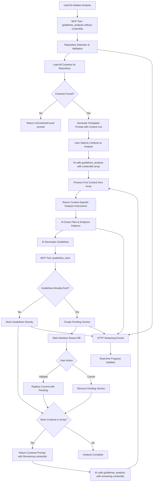

# Guidelines Analysis Workflow

The guidelines analysis workflow is the core feature of Better Context, enabling AI assistants to analyze repository code and generate contextual development guidelines.

It combines repository analysis, AI processing, and structured guidelines generation to create actionable development documentation tailored to specific contexts like testing, architecture, or documentation standards.

## Run the Analysis

Make sure you have at least one context set up for the current project and Better Context is running. Prompt the following:

```
Using better context MCP, run the tool guidelines_analysis to initiate the coding guidelines analysis workflow for this project.
```

## Workflow Architecture



## Workflow Steps

### 1. Analysis Initiation

The workflow begins when an AI assistant calls the `guidelines_analysis` MCP tool without a contextId:

- **Repository Detection**: Identifies the current repository using Git origin URL or working directory path
- **Context Loading**: Retrieves all defined guidelines contexts for the repository
- **Queue Creation**: Creates a processing queue with all contexts that need analysis
- **Initial Prompt**: Returns a structured prompt instructing the AI to begin with the first context

### 2. Context Processing Loop

The workflow processes each context sequentially through a loop mechanism:

#### Per-Context Steps:

1. **Context Analysis Setup**

   - AI calls `guidelines_analysis` with the current context ID
   - Tool returns context-specific analysis instructions and file patterns

2. **Repository Analysis**

   - AI scans relevant files based on context configuration
   - Analyzes code patterns, structures, and conventions
   - Identifies context-specific guidelines opportunities

3. **Guidelines Generation**

   - AI generates actionable guidelines as an array of strings
   - Guidelines are tailored to the specific context (testing, architecture, etc.)

4. **Guidelines Storage**
   - AI calls `guidelines_save` with generated guidelines and context ID
   - System checks if guidelines already exist for this context
   - **New Guidelines**: Stored directly in the database
   - **Existing Guidelines**: Creates a pending version for review

#### Loop Continuation:

- **Context Queue Check**: System determines if more contexts remain unprocessed
- **Continue Prompt**: If contexts remain, generates a continuation prompt for the next context
- **Loop Iteration**: Process repeats from step 1 with the next context
- **Completion**: When all contexts are processed, the analysis workflow completes

### 3. Real-time Updates

Throughout the loop process:

- **HTTP Streaming Events**: HTTP streaming provides real-time progress updates
- **Web Interface**: Updates reflect current analysis status and completed contexts
- **Progress Tracking**: Users can monitor which contexts have been processed

### 4. Analysis Completion

Once all contexts have been processed:

- **Final Update**: Web interface shows all generated guidelines
- **Database Consistency**: All guidelines are properly stored and associated
- **Ready for Use**: Guidelines are immediately available for AI assistants and developers

## Key Features

### Sequential Processing

The loop-based architecture ensures:

- **Focused Analysis**: Each context receives dedicated attention
- **Resource Management**: Processing happens one context at a time
- **Error Isolation**: Issues with one context don't affect others

### Prompt-Driven Workflow

The system uses intelligent prompting with templating:

- **Dynamic Instructions**: Each prompt is tailored to the current context and remaining queue using template variables
- **Template Engine**: Supports variable substitution (`{{variable}}`) and array iteration (`{{#each array}}`) for dynamic content generation
- **Self-Managing**: AI assistants follow structured instructions to complete the entire workflow
- **Flexible Continuation**: Supports interruption and resumption of analysis

### Context-Aware Guidelines

Each context produces specialized guidelines.

## Guidelines Versioning and Diff Management

When generating new guidelines for a context that already has existing guidelines, Better Context implements a versioning system to prevent accidental overwrites and provide visibility into changes.

### Automatic Version Detection

The system automatically detects when guidelines already exist for a context:

- **First-time Generation**: Guidelines are stored directly without versioning
- **Subsequent Generations**: Creates a "pending version" alongside the current guidelines
- **Protection**: Prevents immediate overwrite of existing work

### Diff Visualization

When pending versions are created, the web interface provides a comprehensive diff view:

- **Side-by-side Comparison**: Current guidelines vs. pending changes
- **Line-by-line Analysis**: Visual indicators for added, removed, and unchanged content
- **Context Information**: Clear labeling of which context has pending changes

### User Actions

For each pending version, users can take one of two actions:

#### Validate Changes

- **Action**: Replaces current guidelines with the pending version
- **Effect**: Pending version becomes the new current guidelines
- **Use Case**: When the new analysis provides better or updated guidelines

#### Cancel Changes

- **Action**: Discards the pending version
- **Effect**: Current guidelines remain unchanged
- **Use Case**: When current guidelines are preferred or new analysis is incorrect

### Workflow Considerations

#### Multiple Contexts

- Each context manages its own versions independently
- Partial validation is supported (validate some contexts, cancel others)
- Analysis can continue with remaining contexts after resolving diffs

#### Error Prevention

- System blocks new analysis attempts when unresolved diffs exist
- Clear error messages guide users to resolve pending changes first
- Ensures data consistency and prevents confusion

#### Web Interface Integration

- Visual indicators for contexts with pending changes
- Streamlined workflow for reviewing and managing multiple diffs

### Best Practices

1. **Review Before Validating**: Always examine the diff to understand what's changing
2. **Context-Specific Decisions**: Each context may warrant different actions based on analysis quality
3. **Incremental Updates**: Consider validating high-quality changes and canceling questionable ones
4. **Regular Maintenance**: Address pending diffs promptly to keep the workflow smooth

## Need Help?

- Check the [troubleshooting guide](./troubleshooting.md)
- Report issues on GitHub
