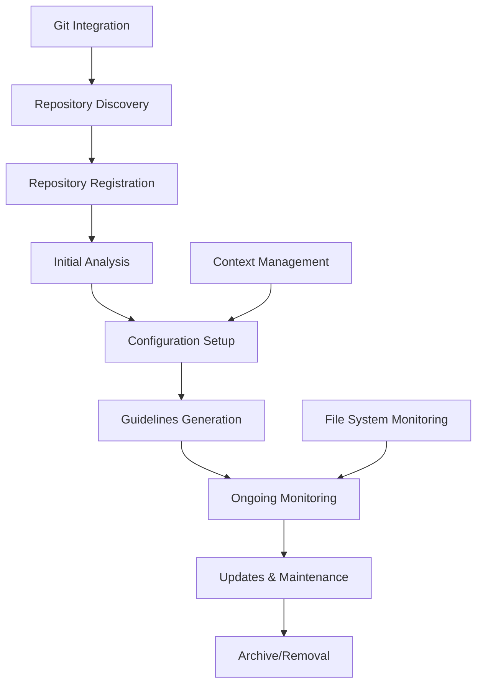

# Repository Management Workflow

Repository management in Better Context involves registering, configuring, and maintaining repositories for guidelines analysis and development workflow optimization.

## Overview

The repository management workflow enables users to connect their development repositories to Better Context, configure analysis settings, and maintain repository-specific guidelines and contexts.

## Repository Lifecycle



## Repository Registration

### Automatic Discovery

Better Context can automatically discover repositories in common locations:

```typescript
class RepositoryDiscovery {
  async discoverRepositories(searchPaths: string[]): Promise<Repository[]> {
    const discovered: Repository[] = []

    for (const searchPath of searchPaths) {
      const gitRepos = await this.findGitRepositories(searchPath)

      for (const repoPath of gitRepos) {
        const repoInfo = await this.extractRepositoryInfo(repoPath)
        discovered.push(repoInfo)
      }
    }

    return discovered
  }

  private async findGitRepositories(basePath: string): Promise<string[]> {
    const repos: string[] = []
    const entries = await fs.readdir(basePath, { withFileTypes: true })

    for (const entry of entries) {
      if (entry.isDirectory()) {
        const fullPath = path.join(basePath, entry.name)
        const gitPath = path.join(fullPath, '.git')

        if (await this.pathExists(gitPath)) {
          repos.push(fullPath)
        }
      }
    }

    return repos
  }

  private async extractRepositoryInfo(repoPath: string): Promise<Repository> {
    const git = simpleGit(repoPath)
    const packageJson = await this.readPackageJson(repoPath)

    return {
      name: packageJson?.name || path.basename(repoPath),
      path: repoPath,
      description: packageJson?.description,
      language: await this.detectPrimaryLanguage(repoPath),
      framework: await this.detectFramework(repoPath),
      gitInfo: {
        branch: await git.branch(['--show-current']),
        remote: await git.remote(['get-url', 'origin']),
        lastCommit: await git.log(['-1']),
      },
    }
  }
}
```

### Manual Registration

Users can manually register repositories through the web interface or CLI:

```typescript
// Web interface registration
class RepositoryRegistrationService {
  async registerRepository(
    data: RepositoryRegistrationData,
  ): Promise<Repository> {
    // Validate repository path
    await this.validateRepositoryPath(data.path)

    // Extract repository information
    const repoInfo = await this.analyzeRepository(data.path)

    // Create database entry
    const repository = await db
      .insert(repositories)
      .values({
        name: data.name || repoInfo.detectedName,
        path: data.path,
        description: data.description || repoInfo.detectedDescription,
        settings: JSON.stringify(data.settings || {}),
        isActive: true,
        createdAt: new Date(),
      })
      .returning()

    // Trigger initial analysis
    await this.scheduleInitialAnalysis(repository[0])

    return repository[0]
  }

  private async validateRepositoryPath(repoPath: string): Promise<void> {
    if (!(await fs.pathExists(repoPath))) {
      throw new Error('Repository path does not exist')
    }

    if (!(await fs.pathExists(path.join(repoPath, '.git')))) {
      throw new Error('Path is not a Git repository')
    }

    // Check if already registered
    const existing = await this.getRepositoryByPath(repoPath)
    if (existing) {
      throw new Error('Repository is already registered')
    }
  }
}
```

### CLI Registration

```bash
# Register repository via CLI
btrx repo add /path/to/repository --name "My Project" --description "Web application"

# Auto-discover and register repositories
btrx repo discover ~/Development --auto-register

# List registered repositories
btrx repo list

# Show repository details
btrx repo info /path/to/repository
```

## Repository Configuration

### Settings Management

Each repository can have custom configuration settings:

```typescript
interface RepositorySettings {
  analysis: {
    enabledContexts: string[]
    excludePaths: string[]
    includePaths: string[]
    autoAnalysis: boolean
    analysisSchedule?: string
  }
  guidelines: {
    defaultFormat: 'markdown' | 'asciidoc'
    includeExamples: boolean
    generateTOC: boolean
    customTemplates: Record<string, string>
  }
  notifications: {
    onAnalysisComplete: boolean
    onGuidelinesUpdated: boolean
    channels: ('email' | 'slack' | 'webhook')[]
  }
  integrations: {
    cicd: {
      enabled: boolean
      provider: 'github' | 'gitlab' | 'jenkins'
      webhookUrl?: string
    }
    ide: {
      vscode: boolean
      jetbrains: boolean
    }
  }
}

class RepositoryConfigurationService {
  async updateRepositorySettings(
    repositoryId: number,
    settings: Partial<RepositorySettings>,
  ): Promise<void> {
    const currentSettings = await this.getRepositorySettings(repositoryId)
    const mergedSettings = { ...currentSettings, ...settings }

    await db
      .update(repositories)
      .set({
        settings: JSON.stringify(mergedSettings),
        updatedAt: new Date(),
      })
      .where(eq(repositories.id, repositoryId))

    // Apply configuration changes
    await this.applyConfigurationChanges(repositoryId, settings)
  }

  private async applyConfigurationChanges(
    repositoryId: number,
    changes: Partial<RepositorySettings>,
  ): Promise<void> {
    if (changes.analysis?.autoAnalysis !== undefined) {
      await this.updateAnalysisSchedule(repositoryId, changes.analysis)
    }

    if (changes.integrations?.cicd?.enabled) {
      await this.setupCICDIntegration(repositoryId, changes.integrations.cicd)
    }
  }
}
```

### Context Configuration

Configure which contexts are enabled for each repository:

```typescript
class ContextConfigurationService {
  async configureRepositoryContexts(
    repositoryId: number,
    contextConfig: ContextConfiguration[],
  ): Promise<void> {
    // Remove existing configurations
    await db
      .delete(repositoryContexts)
      .where(eq(repositoryContexts.repositoryId, repositoryId))

    // Insert new configurations
    for (const config of contextConfig) {
      await db.insert(repositoryContexts).values({
        repositoryId,
        contextName: config.context,
        isEnabled: config.enabled,
        customPrompt: config.customPrompt,
        settings: JSON.stringify(config.settings),
        priority: config.priority || 0,
      })
    }

    // Update repository analysis schedule
    await this.updateAnalysisSchedule(repositoryId)
  }

  async getEnabledContexts(repositoryId: number): Promise<string[]> {
    const contexts = await db
      .select({ name: repositoryContexts.contextName })
      .from(repositoryContexts)
      .where(
        and(
          eq(repositoryContexts.repositoryId, repositoryId),
          eq(repositoryContexts.isEnabled, true),
        ),
      )
      .orderBy(repositoryContexts.priority)

    return contexts.map((c) => c.name)
  }
}
```

## Repository Monitoring

### File System Monitoring

Monitor repository changes for automatic re-analysis:

```typescript
class RepositoryMonitor {
  private watchers = new Map<number, fs.FSWatcher>()

  async startMonitoring(repository: Repository): Promise<void> {
    const watcher = fs.watch(
      repository.path,
      { recursive: true },
      (eventType, filename) => {
        this.handleFileSystemEvent(repository, eventType, filename)
      },
    )

    this.watchers.set(repository.id, watcher)
  }

  private async handleFileSystemEvent(
    repository: Repository,
    eventType: string,
    filename: string | null,
  ): Promise<void> {
    if (!filename || this.shouldIgnoreFile(filename)) {
      return
    }

    const settings = await this.getRepositorySettings(repository.id)

    if (settings.analysis.autoAnalysis) {
      // Debounce file change events
      await this.scheduleAnalysisIfNeeded(repository, filename)
    }
  }

  private shouldIgnoreFile(filename: string): boolean {
    const ignoredPatterns = [
      /\.git\//,
      /node_modules\//,
      /\.DS_Store$/,
      /\.log$/,
      /\.tmp$/,
    ]

    return ignoredPatterns.some((pattern) => pattern.test(filename))
  }

  async stopMonitoring(repositoryId: number): Promise<void> {
    const watcher = this.watchers.get(repositoryId)
    if (watcher) {
      watcher.close()
      this.watchers.delete(repositoryId)
    }
  }
}
```

### Git Integration

Monitor Git repository changes:

```typescript
class GitMonitor {
  async monitorGitChanges(repository: Repository): Promise<void> {
    const git = simpleGit(repository.path)

    // Monitor for new commits
    setInterval(async () => {
      await this.checkForNewCommits(repository, git)
    }, 300000) // Check every 5 minutes
  }

  private async checkForNewCommits(
    repository: Repository,
    git: SimpleGit,
  ): Promise<void> {
    const latestCommit = await git.log(['-1'])
    const storedCommit = await this.getStoredLatestCommit(repository.id)

    if (latestCommit.latest?.hash !== storedCommit) {
      await this.handleNewCommits(repository, git, latestCommit)
      await this.updateStoredLatestCommit(
        repository.id,
        latestCommit.latest?.hash,
      )
    }
  }

  private async handleNewCommits(
    repository: Repository,
    git: SimpleGit,
    latestCommit: any,
  ): Promise<void> {
    const settings = await this.getRepositorySettings(repository.id)

    if (settings.analysis.autoAnalysis) {
      // Analyze changed files
      const changedFiles = await this.getChangedFilesSinceLastAnalysis(
        repository,
        git,
      )
      await this.scheduleIncrementalAnalysis(repository, changedFiles)
    }

    // Send notification
    await this.notifyRepositoryUpdate(repository, latestCommit)
  }
}
```

## Repository Synchronization

### Multi-Environment Sync

Synchronize repository configurations across environments:

```typescript
class RepositorySyncService {
  async syncRepository(
    sourceRepo: Repository,
    targetEnvironment: string,
  ): Promise<void> {
    const syncData = await this.prepareRepositorySync(sourceRepo)

    // Upload to remote sync service
    await this.uploadSyncData(syncData, targetEnvironment)

    // Notify target environment
    await this.notifyTargetEnvironment(targetEnvironment, syncData)
  }

  private async prepareRepositorySync(
    repository: Repository,
  ): Promise<SyncData> {
    return {
      repository: {
        name: repository.name,
        description: repository.description,
        settings: repository.settings,
      },
      guidelines: await this.getRepositoryGuidelines(repository.id),
      contexts: await this.getRepositoryContexts(repository.id),
      metadata: {
        lastSync: new Date().toISOString(),
        version: await this.getRepositoryVersion(repository.id),
      },
    }
  }

  async applySyncData(syncData: SyncData): Promise<void> {
    // Validate sync data
    await this.validateSyncData(syncData)

    // Apply repository changes
    await db.transaction(async (tx) => {
      // Update repository settings
      await this.updateRepositoryFromSync(tx, syncData.repository)

      // Sync guidelines
      await this.syncGuidelines(tx, syncData.guidelines)

      // Sync contexts
      await this.syncContexts(tx, syncData.contexts)
    })
  }
}
```

### Backup and Restore

```typescript
class RepositoryBackupService {
  async createRepositoryBackup(repositoryId: number): Promise<string> {
    const repository = await this.getRepository(repositoryId)
    const backupData = {
      repository,
      guidelines: await this.getRepositoryGuidelines(repositoryId),
      settings: await this.getRepositorySettings(repositoryId),
      contexts: await this.getRepositoryContexts(repositoryId),
      analysisHistory: await this.getAnalysisHistory(repositoryId),
      createdAt: new Date().toISOString(),
    }

    const backupId = uuidv4()
    const backupPath = path.join(this.backupDir, `${backupId}.json`)

    await fs.writeJSON(backupPath, backupData, { spaces: 2 })

    return backupId
  }

  async restoreRepositoryBackup(backupId: string): Promise<void> {
    const backupPath = path.join(this.backupDir, `${backupId}.json`)
    const backupData = await fs.readJSON(backupPath)

    await db.transaction(async (tx) => {
      // Restore repository
      const [restoredRepo] = await tx
        .insert(repositories)
        .values(backupData.repository)
        .returning()

      // Restore guidelines
      for (const guideline of backupData.guidelines) {
        await tx.insert(guidelines).values({
          ...guideline,
          repositoryId: restoredRepo.id,
        })
      }

      // Restore contexts
      for (const context of backupData.contexts) {
        await tx.insert(repositoryContexts).values({
          ...context,
          repositoryId: restoredRepo.id,
        })
      }
    })
  }
}
```

## Repository Analytics

### Usage Metrics

Track repository usage and analysis patterns:

```typescript
class RepositoryAnalytics {
  async trackRepositoryUsage(
    repositoryId: number,
    action: string,
    metadata?: any,
  ): Promise<void> {
    await db.insert(repositoryUsageMetrics).values({
      repositoryId,
      action,
      metadata: metadata ? JSON.stringify(metadata) : null,
      timestamp: new Date(),
    })
  }

  async getRepositoryStats(
    repositoryId: number,
    timeRange: TimeRange,
  ): Promise<RepositoryStats> {
    const stats = await db
      .select({
        totalAnalyses: count(analysisResults.id),
        totalGuidelines: count(guidelines.id),
        lastAnalysis: max(analysisResults.completedAt),
        avgAnalysisDuration: avg(
          sql`EXTRACT(EPOCH FROM (${analysisResults.completedAt} - ${analysisResults.startedAt}))`,
        ),
      })
      .from(repositories)
      .leftJoin(
        analysisResults,
        eq(repositories.id, analysisResults.repositoryId),
      )
      .leftJoin(guidelines, eq(repositories.id, guidelines.repositoryId))
      .where(
        and(
          eq(repositories.id, repositoryId),
          gte(analysisResults.startedAt, timeRange.start),
          lte(analysisResults.startedAt, timeRange.end),
        ),
      )
      .groupBy(repositories.id)

    return stats[0] || this.getEmptyStats()
  }

  async getRepositoryTrends(repositoryId: number): Promise<RepositoryTrends> {
    const trends = await db
      .select({
        date: sql`DATE(${analysisResults.startedAt})`,
        analysisCount: count(analysisResults.id),
        avgDuration: avg(
          sql`EXTRACT(EPOCH FROM (${analysisResults.completedAt} - ${analysisResults.startedAt}))`,
        ),
      })
      .from(analysisResults)
      .where(eq(analysisResults.repositoryId, repositoryId))
      .groupBy(sql`DATE(${analysisResults.startedAt})`)
      .orderBy(sql`DATE(${analysisResults.startedAt})`)

    return trends
  }
}
```

### Health Monitoring

Monitor repository health and analysis quality:

```typescript
class RepositoryHealthMonitor {
  async assessRepositoryHealth(repositoryId: number): Promise<HealthScore> {
    const repository = await this.getRepository(repositoryId)
    const recentAnalyses = await this.getRecentAnalyses(repositoryId, 30) // Last 30 days

    const healthMetrics = {
      analysisFrequency: this.calculateAnalysisFrequency(recentAnalyses),
      analysisSuccess: this.calculateSuccessRate(recentAnalyses),
      guidelinesQuality: await this.assessGuidelinesQuality(repositoryId),
      repositoryActivity: await this.assessRepositoryActivity(repository),
      configurationHealth: await this.assessConfiguration(repositoryId),
    }

    return this.calculateOverallHealth(healthMetrics)
  }

  private calculateAnalysisFrequency(analyses: Analysis[]): number {
    if (analyses.length === 0) return 0

    const daysSinceFirst =
      (Date.now() - analyses[0].startedAt.getTime()) / (1000 * 60 * 60 * 24)
    return analyses.length / daysSinceFirst
  }

  private calculateSuccessRate(analyses: Analysis[]): number {
    if (analyses.length === 0) return 1

    const successfulAnalyses = analyses.filter(
      (a) => a.status === 'completed',
    ).length
    return successfulAnalyses / analyses.length
  }

  async generateHealthReport(repositoryId: number): Promise<HealthReport> {
    const health = await this.assessRepositoryHealth(repositoryId)
    const recommendations = await this.generateRecommendations(
      repositoryId,
      health,
    )

    return {
      repositoryId,
      overallScore: health.overallScore,
      metrics: health.metrics,
      recommendations,
      generatedAt: new Date(),
    }
  }
}
```

## Repository Cleanup

### Automated Cleanup

Automatically clean up old data and unused repositories:

```typescript
class RepositoryCleanupService {
  async scheduleCleanup(): Promise<void> {
    // Run cleanup daily at 2 AM
    cron.schedule('0 2 * * *', async () => {
      await this.performCleanup()
    })
  }

  private async performCleanup(): Promise<void> {
    await this.cleanupOldAnalysisResults()
    await this.cleanupUnusedRepositories()
    await this.cleanupOrphanedGuidelines()
    await this.compactDatabase()
  }

  private async cleanupOldAnalysisResults(): Promise<void> {
    const cutoffDate = new Date()
    cutoffDate.setMonth(cutoffDate.getMonth() - 6) // Keep 6 months

    await db
      .delete(analysisResults)
      .where(lt(analysisResults.startedAt, cutoffDate))
  }

  private async cleanupUnusedRepositories(): Promise<void> {
    const inactiveRepos = await db
      .select()
      .from(repositories)
      .where(
        and(
          eq(repositories.isActive, false),
          lt(repositories.updatedAt, sql`NOW() - INTERVAL '30 days'`),
        ),
      )

    for (const repo of inactiveRepos) {
      await this.removeRepository(repo.id)
    }
  }

  async removeRepository(repositoryId: number): Promise<void> {
    await db.transaction(async (tx) => {
      // Remove related data
      await tx
        .delete(guidelines)
        .where(eq(guidelines.repositoryId, repositoryId))
      await tx
        .delete(analysisResults)
        .where(eq(analysisResults.repositoryId, repositoryId))
      await tx
        .delete(repositoryContexts)
        .where(eq(repositoryContexts.repositoryId, repositoryId))

      // Remove repository
      await tx.delete(repositories).where(eq(repositories.id, repositoryId))
    })

    // Stop monitoring
    await this.repositoryMonitor.stopMonitoring(repositoryId)
  }
}
```

## Integration with External Tools

### CI/CD Integration

Integrate with continuous integration and deployment pipelines:

```typescript
class CICDIntegration {
  async setupWebhook(
    repositoryId: number,
    cicdConfig: CICDConfig,
  ): Promise<string> {
    const webhookUrl = await this.generateWebhookUrl(repositoryId)

    // Configure webhook in CI/CD platform
    await this.configureCICDWebhook(cicdConfig, webhookUrl)

    // Store configuration
    await this.storeCICDConfig(repositoryId, cicdConfig)

    return webhookUrl
  }

  async handleCICDWebhook(repositoryId: number, payload: any): Promise<void> {
    const eventType = this.determineCICDEventType(payload)

    switch (eventType) {
      case 'push':
        await this.handlePushEvent(repositoryId, payload)
        break
      case 'pull_request':
        await this.handlePullRequestEvent(repositoryId, payload)
        break
      case 'deployment':
        await this.handleDeploymentEvent(repositoryId, payload)
        break
    }
  }

  private async handlePushEvent(
    repositoryId: number,
    payload: any,
  ): Promise<void> {
    // Trigger analysis for changed files
    const changedFiles = this.extractChangedFiles(payload)
    await this.scheduleIncrementalAnalysis(repositoryId, changedFiles)
  }
}
```

This comprehensive repository management workflow documentation covers all aspects of managing repositories within Better Context, from initial discovery and registration through ongoing monitoring, maintenance, and cleanup. The system provides robust tools for repository lifecycle management while maintaining high performance and reliability.
